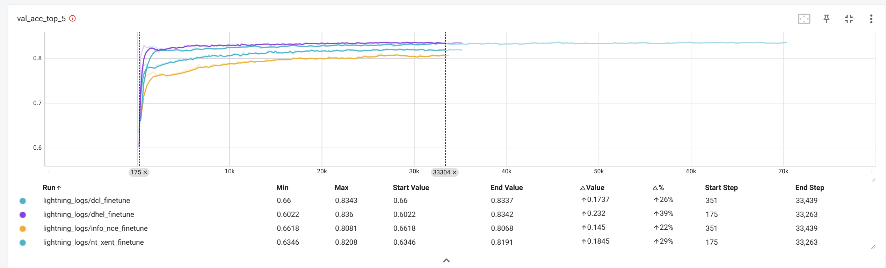

# Contrastive Learning Loss Comparision

This repository is re-create the results from the paper [Bridging Mini-Batch and Asymptotic Analysis in Contrastive Learning: From InfoNCE to Kernel-Based Losses](https://arxiv.org/abs/2405.18045).
It compare's the performance of different contrastive learning loss functions on the CIFAR-100 dataset & on text-pretraining for MS MARCO passage ranking dataset.
The following loss functions are compared:
  * [InfoNCE Loss](https://arxiv.org/pdf/1807.03748v2 "Representation Learning with Contrastive Predictive Coding")
  * [NT-Xent Loss (SimCLR)](https://arxiv.org/abs/2002.05709 "A Simple Framework for Contrastive Learning of Visual Representations")
  * [DCL Loss (Decoupled Contrastive Learning)](https://arxiv.org/abs/2110.06848 "Decoupled Contrastive Learning")
  * [DHEL Loss (Decoupled Hypershperical Energy Loss)](https://arxiv.org/abs/2405.18045 "Bridging Mini-Batch and Asymptotic Analysis in Contrastive Learning: From InfoNCE to Kernel-Based Losses")
  * [VICReg Loss (Variance-Invariance-Covariance Regularization)](https://arxiv.org/pdf/2105.04906 "Vicreg: Variance-Invariance-Covariance Regularization For Self-Supervised Learning")

InfoNCE loss variants are implemented in the [lib/losses.py](lib/losses.py) file.

## Table of Contents
- [Contrastive Learning Loss Comparision](#contrastive-learning-loss-comparision)
  - [Table of Contents](#table-of-contents)
  - [Methodology](#methodology)
    - [Vision Models](#vision-models)
    - [Text Models](#text-models)
  - [Usage](#usage)
  - [Results](#results)
  - [Comparison Images](#comparison-images)
    - [Loss Comparison for Vision Models](#loss-comparison-for-vision-models)
    - [Loss Comparison for Text Models](#loss-comparison-for-text-models)
  - [References](#references)


## Methodology

### Vision Models
* The CIFAR-100 dataset is used to train a ResNet-18 model. 
* The model is pre-trained on all the training data for 200 epochs using the contrastive learning loss functions mentioned above.
* The model is then fine-tuned for classification on 90% of the data for another 200 epochs and the rest 10% of the data is used for validation.
* The accuracy of the model is then evaluated on the test set.

### Text Models
* The MS MARCO passage ranking dataset is used to train a MiniLM model.
* Model is pre-trained on the training data for 10 epochs using the contrastive learning loss functions mentioned above.
* The model is then evaluated on the dev set on passage retrieval metrics like Recall@k, MRR, etc.

## Usage
To run the code, follow the steps below:
```bash
# To run all the loss functions
$ sh ./benchmark.sh

# To run a specific loss function for vision models (resnet-18 on CIFAR-100)
$ python train.py --loss_func <loss_function> --continue_pretrain --continue_finetune
# loss_function: info_nce, dcl, dcl_symmetric, nt_xent, dhel, vicreg
# Check python train.py --help for more options

# To run a specific loss function for text models (MS MARCO passage ranking dataset)
$ python train_text.py --loss <loss_function>
# loss: MNRL, INFO_NCE, NT_XENT, DCL, DHEL, INFO_NCE_ANGLE
```

## Results
The following table shows the performance of different contrastive learning loss functions on the CIFAR-100 dataset.

| Loss Function | Top-1 Accuracy | Top-5 Accuracy | Additional Notes                                                               |
| ------------- | -------------- | -------------- | ------------------------------------------------------------------------------ |
| Supervised    | 0.6091         | 0.8558         | All layers fully trained, where others only have classification layer trained. |
| InfoNCE Loss  | 0.5256         | 0.8046         |                                                                                |
| NT-Xent Loss  | 0.5364         | 0.8115         | -                                                                              |
| DCL Loss      | 0.5629         | 0.8322         | faster than NT-Xent but slower than DHEL.                                      |
| DCL Sym Loss  | 0.5701         | 0.837          | Symmetric version of DCL Loss.                                                 |
| DHEL Loss     | 0.5614         | 0.8256         | Classification accuracy converges fast  (high uniformity?)                     |
| VICReg Loss   | -              | -              | Finetuning Collapses, need to investigate if additional tricks are required.   |

## Comparison Images

### Loss Comparison for Vision Models
The following image shows the comparison of the loss functions.
We can see that the DHEL / DCL loss converges faster than the other loss functions, and in the order mentioned in the paper

`DHEL / DCL > NT-Xent > InfoNCE.`


### Loss Comparison for Text Models


## References

* [A Comprehensive Review of best models on MTEB](https://www.semanticscholar.org/reader/82de481ebb5cf401b215178c20b058c7c1a4f9cd "Recent advances in text embedding: A Comprehensive Review of Top-Performing Methods on the MTEB Benchmark")
* [GTE Models: paper](https://www.semanticscholar.org/reader/84109e1235b725f4bb44a54bab8b493bd723fdd3 "Towards General Text Embeddings with Multi-stage Contrastive Learning")
* [InfoCSE with Angular Loss](https://aclanthology.org/2022.acl-long.336.pdf "A Contrastive Framework for Learning Sentence Representations from Pairwise and Triple-wise Perspective in Angular Space")
